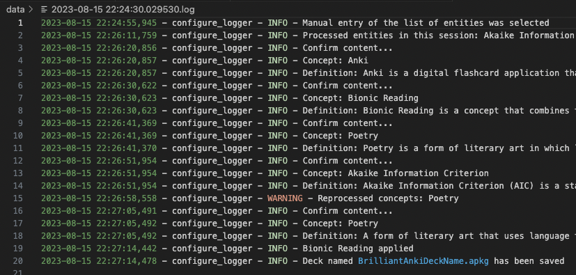
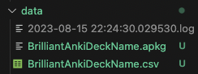

# BOLD FISH

### Use large language model (LLM) and Bionic Reading to enhance the creation of Anki flashcards and learning from them!


## What is it? :fire:

It is a software application that combines the following three actions:

1. assigns definitions to the indicated concepts using the OpenAI API (Generative Pre-trained Transformer model; gpt-3.5-turbo by default)
2. formats definitions to Bionic Reading (BR) format
3. Creates a ready-to-use deck of Anki flashcards

## Who is the preferred user? :wave:

It is intended for students and professionals who, like the author, have tendencies to list entities on the margin.

The application solves the problem of time-consuming preparation of simple flashcards, and additionally
revises texts so that the most concise parts of words are highlighted based on BR method
- a reading system that supports the reading flow (the eye is guided through the text using of typographic highlights, more about: https://bionic-reading.com/br-about/)


## Why you should try? :bulb:

1. Flashcards enhance active recall, enhance memorization, and offer portable, efficient learning. They engage your memory effectively for better understanding and retention.
2. Skim, annotate, and visualize for deep comprehension. Summarize and adapt for optimal retention. Navigate seamlessly, conquer distractions. Elevate study efficiency in the digital era.


## Requirements to run :rocket:

In order to run the package, you must know the basics of Poetry:
https://python-poetry.org/docs/

To use the deck, check https://docs.ankiweb.net/getting-started.html


## How it works? :helicopter:

### Using as class method:

```python
from boldfish import Boldfish

# to use OpenAI to assign definitions
OPENAI_API_KEY = os.environ.get("OPENAI_API_KEY") 

# to use Bionic Reading on definitions
BIONIC_READING_X_RAPID_API_KEY = os.environ.get("BIONIC_READING_X_RAPID_API_KEY") 

# only to assign definitions or create Anki deck
boldfish = Boldfish(OPENAI_API_KEY)

# or

"""
    openai.api_key value automatically by reading it from an environment variable
    named OPENAI_API_KEY. The OpenAI Python library is designed to check for this
    environment variable by default
"""
boldfish = Boldfish()

# to assign definitions, allow format using Bionic Reading or create Anki deck
boldfish = Boldfish(OPENAI_API_KEY, BIONIC_READING_X_RAPID_API_KEY)


# example to assign the definitions, based on string input or the path
definitions = boldfish.get_definitions("fish")
definitions = boldfish.get_definitions("fish, Python, Anki")
definitions = boldfish.get_definitions("./data/test.csv")
definitions = boldfish.get_definitions("./data/test.json")

# to create the deck
# definitions: dictionary entity:'definition'
boldfish.create_deck_of_flashcards(definitions, 
                                   "<<deckName>>",
                                   "<<output-path>>")
```

### Using the CLI:

```console
poetry run python app/cli.py  
```

#### Log example (only CLI):


#### Output example (Anki flashcard):



## Externally provided API :link:

To use this package you need to provide 2 keys in the `.env` file: `OPENAI_API_KEY` and `BIONIC_READING_X_RAPID_API_KEY`. To get them, you need to create accounts on the API providers website. The use of these APIs is free only under certain conditions. Please refer to the documentation to verify costs.

- https://platform.openai.com/docs/quickstart/build-your-application
- https://openai.com/pricing
- https://rapidapi.com/bionic-reading-bionic-reading-default/api/bionic-reading1
- https://help.openai.com/en/articles/7042661-chatgpt-api-transition-guide
- https://www.geeksforgeeks.org/how-to-use-chatgpt-api-in-python/

> If you have trouble using the ``.env`` file, please check: 

```
poetry env remove 3.10  
sudo poetry cache clear --all pypi
env $(cat .env) poetry shell  
poetry install
poetry run python app/main.py
```


## Testing and security :police_car:

Coverage goal before the initial release of v1.0.0 is 100%, including unit, time performance and end-to-end tests.

All stay within localhost (excluding potential data leakage to vendors based on their license - check the terms of use of the API before use).

----

#### Comment for those intrigued by the name of the package

If you are intrigued by the name of the package: flashcards in Polish (*fiszki*) sound similar to the word fish, hence the idea for the name. Have a nice day! :fish: